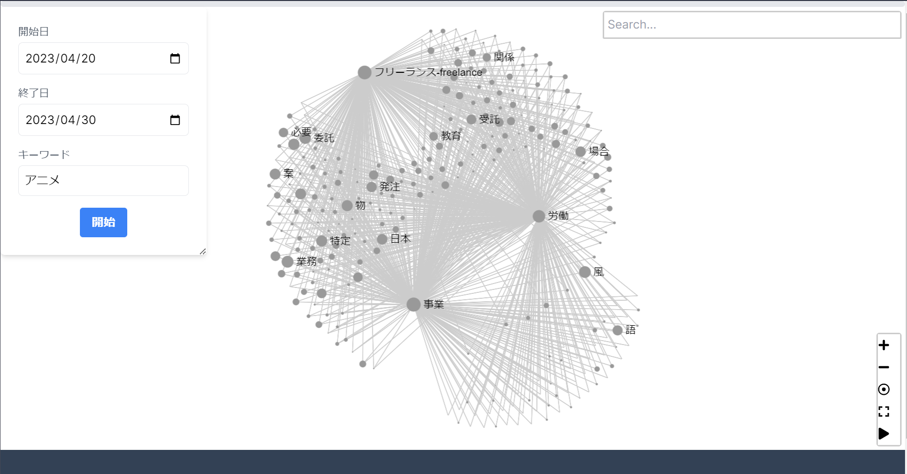

# 国会議事録の共起分析

## 共起ネットワーク

国会議事録中から重要と思われる単語を、ネットワーク図によって確認することができます。

ネットワーク図は、分析対象となった議事録中の会議ごとに現れた共起単語を使用して表現されています。

### 分析対象

議事録の分析対象は、画面最上部の左側にあるパネル（検索パネル）から、`キーワード`や`期間`を指定して絞ることができます。

分析対象は、取得された議事録全体からTF-IDFを用いて、より重要と思われる約300単語に絞られています。

### ネットワーク図の見方について

ネットワーク図中の各単語の大きさは、共起行列の固有ベクトル中心性で表されています。

「開始」ボタン押下後、最初に表示されるネットワークグラフは、分析対象の議事録のうち、**固有ベクトル中心性の値が大きな3単語とその共起関係にある単語**が表示されます。

単語クリックによって、さらにその単語とその共起関係にある単語が表示されます。

## 中心単語の時系列比較

各単語の中心度は、折れ線グラフによって確認することができます。

折れ線グラフ上部の単語をクリックすることで、折れ線グラフに描画することができます。

初めは、より中心的な3単語がグラフ上で表現されます。

> ほとんどの場合1に限りなく近い値になり、有用なグラフにならないことが多いです。

### 比較対象の追加

グラフ左上の青いボタンにより、分析対象の議事録のうち、**議事録の中心性の値が大きい順に50単語ずつ追加**されます。

### 横軸の変更

横軸は、デフォルトで`会議ごと`で表現されています。これは分析対象の議事録から、会議ごとに中心性を計算した結果がグラフに表現されています。

> より実際的な使い方の説明として、
>> 会議ごとに重要なトピックを単語ごとに追うことで確認できます。
> と言いたいところですが、まだまだ課題あります。

横軸は「検索パネル」より`月ごと`に変更することができ、同様に月ごとに中心性の比較をすることができます。

## サブネットワーク

ページ最下部から「+Add Network Graph」をクリックすると、会議ごとの共起ネットワーク図を確認することができます。

言い換えると分析対象の議事録のうち、**会議ごとの共起関係を比較する**ことができます。

デフォルトでは、`会議ごと`ですが前述の「検索パネル」から`月ごと`を選択し検索することで、月ごとの共起関係を確認することができます。

## 分析対象のカスタママイズ

先述の `キーワード`, `期間`, `分析`, `会議ごと` or `月ごと` に加え、分析をカスタムすることができます。

### `出力品詞`の選択

分析に使用する品詞を選択できます。

### `除外ワード`の追加

分析に含めたくない単語を除外することができます。

### `使用API`の変更

アプリに使用している [国会会議録検索システム　検索用API](https://kokkai.ndl.go.jp/api.html) 記載の、

**発言単位出力**と**会議単位出力**を使用を選択できます。

#### 発言単位出力

`発言単位出力`を使用すると、検索された`期間`と`キーワード`に一致する発言を取得対象とします。

> 比較的検索結果について、単語の意味的にトピックがまとまりやすくお勧めです。

#### 会議単位出力

`会議単位出力`は、検索された`期間`と`キーワード`に**一致する発言のある会議全体の発言を取得対象**とします。

そのため一つの会議で意味的に異なるトピックについて議論されている場合、意図したネットワーク図にならないことがあります。

> 主観としてこの場合が多いです。
> しかし発言単位出力も、一つの発言で意味的に異なるトピックについて扱うことも多いので難しいところです。

## 起動方法

``docker compose up --build``

[docker](https://docs.docker.jp/get-docker.html)が必要です。

## 開発環境

vsCode の dev container での開発を前提。

`dev container` を立ち上げてください。

クライアントは`React`(./web)

サーバは`Go`です。

### Test

Goのみテストを書いています。

`make test`

Goサーバはホットリロードさせていないので、積極的にテストを書き検証します。

> 今のところ必要性を感じていない。

### サーバ

クライアント: `make drun`
サーバ: `make run`

[http://localhost:3030] にアクセス。

#### 検証時

静的ビルド
`make srun`

[http://localhost:8080] にアクセス。

### proto

通信に[Connect](https://connectrpc.com/)を利用しています。

APIの変更は、protoファイルを変更しコマンドを実行してコードを生成してください。

proto ファイルは、`./api` 以下にあり、生成は、`make genbuf`です。

## 大事なこと

国会議事録は [国会会議録検索システム　検索用API](https://kokkai.ndl.go.jp/api.html) から取得しています。

辞書として [現代書き言葉UniDic](https://clrd.ninjal.ac.jp/unidic/download.html#unidic_bccwj) を使用しています。

## 問題点・改善

取り組むかもしれないし、取り組まないかもしれない。

### 意味の分析

ネットワーク図はまあまあかもしれないが、折れ線グラフが微妙。

トピックを追いたいが、単語の機械的な分析ではむずそう。か？

単語の意味で、どうにかする必要がある気がする。

そうすると結構な追加実装と知識が必要になりそう。

### UI以外のブラウザ処理

`React`の実装が甘い気がする。というか、`wasm`してみたい。

### スクロール

辛すぎ。
